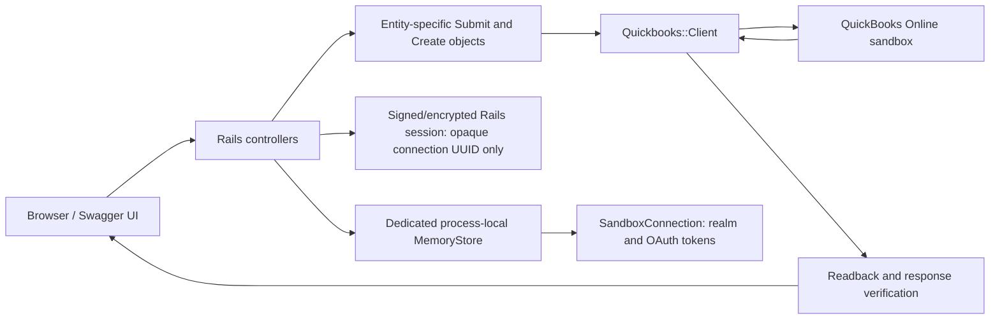

# Architecture

## Current boundary

The application is a database-free, single-process QuickBooks Online sandbox bridge.

Swagger never calls Intuit directly. It has no bearer scheme or authorization control. It uses same-origin Rails
routes, the current Rails session, and Rails CSRF protection. OAuth tokens never enter HTML, JavaScript, OpenAPI,
cookies, JSON responses, or URL parameters.

## Process-local connection

`Quickbooks::SandboxConnection` is an immutable plain Ruby value with:

- opaque UUID;
- validated numeric realm ID;
- access and refresh tokens;
- access-token and optional refresh-token expiry;
- sandbox environment marker;
- creation, update, and refresh timestamps.

It has no persistence behavior or public serialization. Its inspection output redacts both tokens.

`Quickbooks::SandboxConnectionStore` encapsulates a dedicated
`ActiveSupport::Cache::MemoryStore`. Controllers and clients never access the cache directly. The store creates,
fetches, replaces, refreshes, disconnects, and deletes connections through a narrow domain API.

One store instance is configured per Rails process. Development reload invokes Rails' preparation callback and
may replace the store. A restart, reload, process replacement, or cache eviction therefore requires reconnecting.

## Session ownership

After a successful OAuth callback, Rails stores only the connection UUID in the browser session. Connection-scoped
routes require the route UUID to match that session UUID before looking in the process store. Invalid, mismatched,
or missing handles do not reveal whether another handle exists; the API returns HTTP 401 with
`quickbooks_reconnect_required`.

OAuth state remains time-limited, single-use, and compared with a constant-time helper.

## Refresh and disconnect synchronization

MemoryStore makes individual cache operations thread-safe, but a token refresh is a compound operation. The store
therefore keeps a mutex per connection and synchronizes access to that mutex registry.

Within the connection lock, refresh:

1. fetches the current value again;
2. checks whether another thread already rotated the tokens;
3. checks expiry again;
4. calls Intuit refresh at most once;
5. builds a new immutable connection;
6. replaces the cached value before releasing the lock.

Disconnect uses the same lock, fetches the latest rotated refresh token, revokes it, and deletes the local value.
A disconnect cannot leave a late refresh behind, and a refresh cannot recreate a deleted connection. Lock entries
are removed when no owner or waiter remains.

## Finance request flow

The API has 17 finance GET operations and 11 finance POST operations.

GET operations may refresh an expired token and may make one authenticated retry after a QuickBooks 401.

Each POST:

1. resolves the session-owned process-local connection;
2. permits a bounded entity-specific input shape;
3. normalizes ISO dates and decimal strings;
4. validates accounting and current QuickBooks references;
5. generates one UUID inside `Quickbooks::Client#post`;
6. sends one QBO POST with that UUID as `requestid`;
7. reads the created entity back;
8. verifies and serializes the readback;
9. returns the entity with HTTP 201.

POST has no automatic retry. There is no caller idempotency key, request digest, replay response, local submission
state, or audit record.

Create-time duplicate-name preflight is intentionally absent. Repeated POST execution can create duplicate
records. QuickBooks remains free to enforce its own constraints.

## Responsibilities

- Controllers handle HTTP parameters, status codes, session ownership, and normalized errors.
- Eleven explicit `Submit` classes coordinate their matching create/readback/serializer flow.
- Entity-specific `Create` classes own accounting validation, payload construction, and response verification.
- `Quickbooks::Client` owns fixed sandbox HTTP infrastructure, token refresh, internal `requestid`, timeouts, and
  sanitized upstream errors.
- `Quickbooks::Oauth::TokenClient` owns token and revocation endpoints.
- `SandboxConnectionStore` owns process-local token lifecycle and synchronization.

There is no generic service base class, repository layer, callback orchestration, or dynamic entity dispatcher.

## Database removal

The application does not load the Active Record railtie and has no Active Record models, `config/database.yml`,
`db/` directory, direct `pg` dependency, database setup task, or database runtime check. Rails meta-gem
dependencies may still include inactive Active Record components transitively.

Existing PostgreSQL connection, mapping, idempotency, and audit records are intentionally abandoned. No migration
path is provided.

## Deployment limits

Puma runs in single mode with normal thread concurrency. Worker configuration fails fast because separate
processes would have unrelated connection stores. Multiple replicas are equally unsupported.

This architecture is for a local sandbox demonstration only. Production requires encrypted persistent token and
realm storage, durable ownership, multi-process coordination, operational audit/recovery, and a new security
review.
