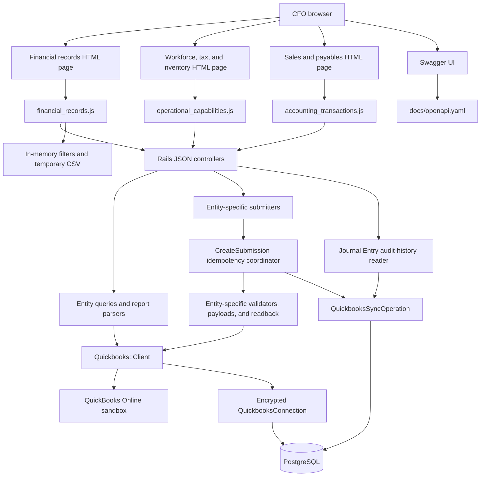

# Architecture

This is a small Rails monolith. Rails serves three HTML/vanilla-JavaScript dashboards, exposes twenty-nine CFO JSON
operations, stores the encrypted QuickBooks connection and audited create operations, and calls the QuickBooks
Online sandbox REST API. There is no separate frontend project/process or generic integration framework.

## Responsibilities

- `Quickbooks::ConnectionsController`: connect/disconnect OAuth and show company information.
- `Quickbooks::JournalEntriesController`: render only the dashboard shell and API URLs; it performs no QuickBooks data exchange.
- `Quickbooks::OperationsController`: render only the separate workforce/tax/inventory shell and four API URLs.
- `Quickbooks::TransactionsController`: render only the sales/payables shell and six API URLs.
- `ApiDocsController`: render the separate Swagger page and serve the checked-in OpenAPI YAML; it performs no QuickBooks data exchange.
- `Api::V1::Quickbooks::AccountsController`: JSON GET for eligible active Accounts.
- `Api::V1::Quickbooks::FinancialReportsController`: five fixed JSON GET actions for Profit & Loss, Balance
  Sheet, Cash Flow, General Ledger, and Trial Balance; it accepts only documented parameters and delegates work.
- `Api::V1::Quickbooks::JournalEntriesController`: JSON GET/POST for Journal Entries.
- `Api::V1::Quickbooks::JournalEntryOperationsController`: paginated/date-filtered JSON GET for connection-scoped
  local audit operations; it does not call QuickBooks.
- `Api::V1::Quickbooks::EmployeesController`, `TimeActivitiesController`, `TaxCodesController`, and
  `InventoryItemsController`: explicit GET/POST HTTP boundaries for the four Phase 13 domains.
- `CustomersController`, `VendorsController`, `InvoicesController`, `BillsController`,
  `CustomerPaymentsController`, and `BillPaymentsController`: explicit GET/POST boundaries for Phase 14.
- `Quickbooks::JournalEntries::AuditSerializer`: exposes the safe audit projection while excluding idempotency keys, digests, token data, and raw result payloads.
- `app/assets/javascripts/financial_records.js`: calls the nine financial-record operations, renders one selected financial
  statement plus QuickBooks/local audit data, sends statement dates/basis and transaction-date/page parameters,
  loads Journal Entry/audit pages independently, derives memo/status-filtered arrays from loaded pages, exports
  three safe CSV projections, holds one UUID idempotency key per intended submission, submits JSON with the Rails
  CSRF token, and turns normalized failures into one dismissible alert plus an explicit unavailable state.
- `app/assets/javascripts/operational_capabilities.js`: calls four Phase 13 GET APIs independently, renders their
  tables and constrained selectors, holds one UUID per intended form submission, confirms all four real sandbox
  writes, and exposes safe API failures without putting entity logic in the browser.
- `app/assets/javascripts/accounting_transactions.js`: calls six Phase 14 GET APIs independently, renders their
  tables/reference choices, confirms each real sandbox write, and preserves a UUID per intended submission.
- `app/assets/javascripts/api_docs.js`: initializes Swagger UI with GET-only interactive execution; POST remains documentation-only.
- `Quickbooks::Accounts::Query`: GET active QuickBooks accounts for the two dropdowns.
- `Quickbooks::Reports::Parameters`: validate exact report-specific ISO dates, the six-month period limit, and
  Cash/Accrual only where Intuit supports it; build the native QuickBooks report query parameters.
- `Quickbooks::Reports::Query`: map only five fixed report keys to fixed QuickBooks paths and issue the GET
  through the existing client.
- `Quickbooks::Reports::Parser` and `Serializer`: validate report metadata/decimal money strings, flatten nested
  section/data/summary rows while preserving depth and column order, and emit the stable Rails JSON shape.
- `Quickbooks::JournalEntries::ReadParameters`: parse and validate the shared ISO-date/page contract once for both
  read APIs; calculate the QuickBooks one-based position and PostgreSQL offset.
- `Quickbooks::JournalEntries::ReadPage`: immutable records, parameters, and `has_more` result used to render the
  common pagination/filter metadata.
- `Quickbooks::JournalEntries::Query`: apply transaction-date predicates and deterministic ordering to a
  `STARTPOSITION`/`MAXRESULTS` QuickBooks query.
- `Quickbooks::JournalEntries::AuditHistory`: apply the same transaction-date/page contract to the connection's
  local audit rows using Active Record `where`, `order`, `offset`, `limit`, and `readonly`.
- `Quickbooks::CreateSubmission`: narrow shared coordinator for connection-scoped UUID reservation, digest
  matching, safe replay/refusal, and succeeded/rejected/uncertain audit state; it knows no entity payload fields.
- Entity-specific `Submit`, `Create`, `Query`, `Details`, and `Serializer` classes under `Employees`,
  `TimeActivities`, `TaxCodes`, `InventoryItems`, `Customers`, `Vendors`, `Invoices`, `Bills`,
  `CustomerPayments`, and `BillPayments`: validate current QuickBooks references, build only the
  documented payload, make the call through `Client`, and verify readback.
- `Quickbooks::JournalEntries::Submit`: supplies Journal Entry metadata and its existing creator/serializer to the common coordinator.
- `Quickbooks::JournalEntries::Create`: validate the form, validate selected active accounts, build two balanced lines, POST one Journal Entry, and GET it back by returned ID.
- `Quickbooks::Client`: the only Faraday boundary; adds realm path, sandbox host, bearer/JSON headers, minor version, token refresh, timeouts, safe errors, and sanitized request instrumentation.
- `QuickbooksConnection`: encrypted local OAuth tokens and connection state.
- `QuickbooksSyncOperation`: local idempotency and audit evidence for one allowed create attempt, scoped by
  connection and a fixed operation/entity pair; it stores no OAuth token or client secret.

The dashboard does not use local Account mappings. The old `account_mappings` table remains in the database from earlier work but has no route, controller, view, or role in the current workflow.

## Request boundaries

GET requests may refresh an expired token and retry once after a 401. POST refreshes before sending when the
local token is expired, but it does not automatically replay after a 401 because QuickBooks may already have
committed the entity.

Financial reports are transient reads. Profit & Loss, Cash Flow, General Ledger, and Trial Balance accept periods
no longer than six calendar months; Balance Sheet accepts one as-of date. The report parser preserves values rather than deriving
totals, and no report payload is persisted or added to the Journal Entry audit ledger.

The audit-history GET is different from the financial GETs: it is an Active Record association query ordered by
`created_at DESC, id DESC`, paginated by offset/limit, and optionally constrained by the original
`request_payload.txn_date`. It remains available for retained audit history even if a connection is later
disconnected, and it never instantiates `Quickbooks::Client`.

The two GET APIs share one explicit read-parameter object rather than a repository or pagination framework.
Both fetch `per_page + 1`, return only `per_page`, and use the extra row only to determine `has_more`. Direct API
requests default to 50 records per page and are capped at 50; the dashboard deliberately requests 25. QuickBooks
pages are ordered by `TxnDate DESC, Id DESC`. Local audit pages use their independent chronological ordering.

Dashboard filtering and export span two read boundaries. Inclusive transaction dates reload page 1 from both
servers; memo and audit status derive visible arrays from pages loaded in memory without mutating source values.
The two **Load more** actions fetch independently and de-duplicate by connection-scoped entity/operation ID in
the browser. CSV exports include only currently visible loaded records through temporary Blob URLs. CSV values
are quoted and guarded against spreadsheet formula prefixes; decimal amount strings are copied unchanged rather
than recalculated.

Offset/`STARTPOSITION` pages are intentionally simple at this scale. A concurrent insertion can shift later
offset pages; deterministic order plus browser ID de-duplication avoids showing a duplicate, but this is not a
point-in-time snapshot export. A cursor/snapshot protocol would require a later explicit phase if that audit
property becomes necessary.

The JSON create request accepts only date, memo, amount, debit Account ID, and credit Account ID, plus a required
UUID `Idempotency-Key` header. The local audit reservation commits before the QuickBooks call; Rails never holds a
database transaction open over external HTTP. `Create` rereads active accounts before POST, rejects the same
account on both sides, excludes A/R and A/P, forwards the UUID as Intuit `requestid`, and reads the created
transaction back before returning HTTP 201. Money is validated and calculated with `BigDecimal`; the outgoing
QuickBooks JSON uses an exact decimal JSON number without conversion through Ruby `Float`.

A repeated completed key with the same canonical five fields is served from the local normalized result with HTTP
200. Different input or an unresolved/rejected operation returns HTTP 409 and does not call QuickBooks. Connection
scope appears in both the unique database key and all entity lookup indexes; a QuickBooks entity ID is never
treated as globally unique.

The Phase 13 create requests follow the same coordinator state machine while retaining entity-specific policy.
Employee accepts names and optional contact data only. TimeActivity validates an active Employee and whole
hours/minutes. TaxCode validates a unique name and existing active TaxRate. Inventory Item validates exact ISO
date, decimal strings through `BigDecimal`, and currently eligible income/COGS/asset Accounts. Each creator owns
its documented vendor payload and readback comparison; none of those fields or rules are generalized into the
coordinator. No external HTTP call occurs inside a database transaction.

Phase 14 extends that state machine with six fixed operation/entity pairs. Customer and Vendor validate unique
active display names. Invoice validates an active Customer and sale Item. Bill validates an active Vendor,
expense Account, and Accounts Payable Account. Payment reloads one open Invoice and cannot exceed its balance.
BillPayment reloads one open Bill plus an active bank Account, uses `PayType: Check`, and cannot exceed the Bill
balance. Transaction creates are single-line by design, and every successful response is read back by returned ID.

The failure UI stays inside the existing dashboard asset. It uses native HTML, CSS, and JavaScript; there is no
toast library, frontend framework, event bus, or second error abstraction. Rails remains responsible for the
normalized JSON error envelope, while the browser is responsible only for presenting the safe message.

## Security

- Sandbox only; production configuration fails closed.
- Client secret and Active Record encryption keys live in encrypted Rails credentials or injected environment variables.
- Access/refresh tokens are encrypted in PostgreSQL and never rendered or serialized.
- OAuth state is random, one-time, expiring, and securely compared.
- Request/response bodies and authorization headers are not logged.
- CSV values are fully quoted and formula-trigger prefixes from QuickBooks/local text are neutralized before
  download.
- The dashboard is automatically enabled only in development; its non-development flag is not a replacement for user authentication.
