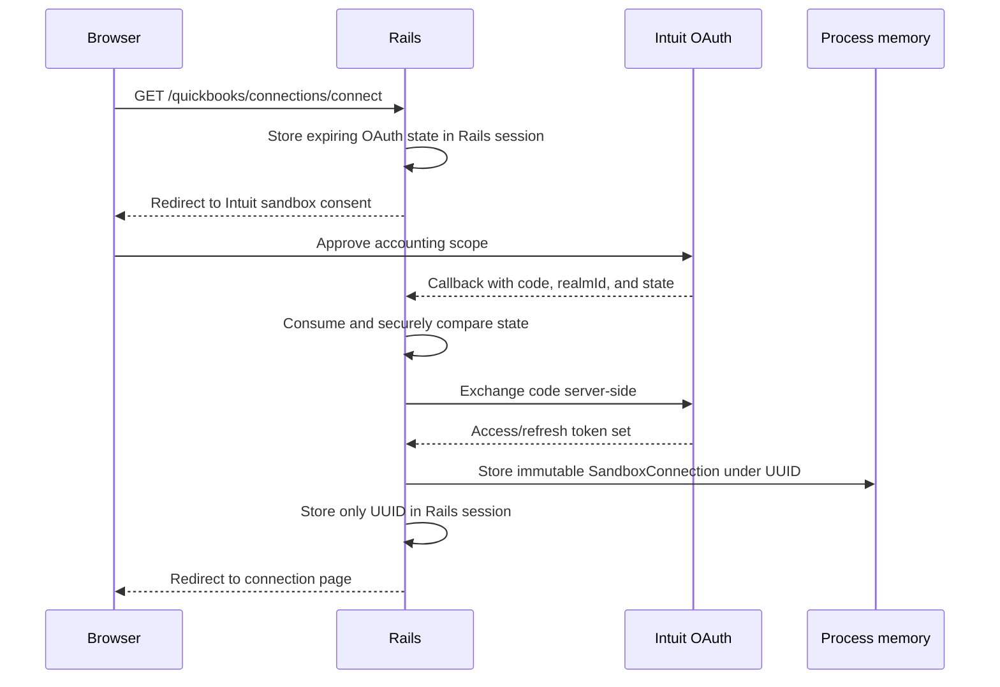
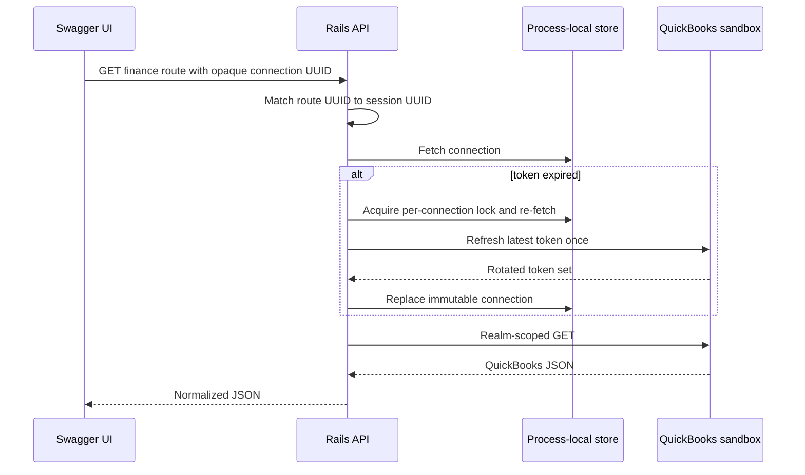
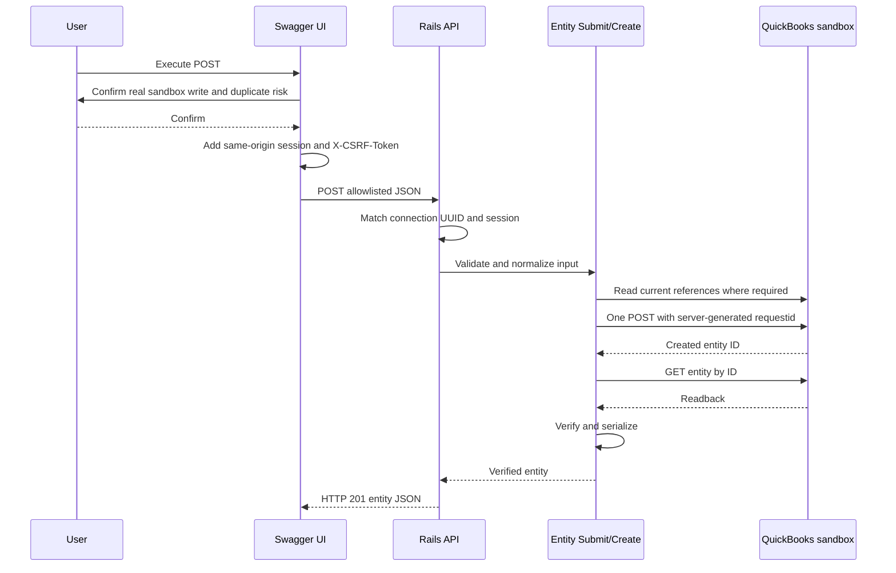
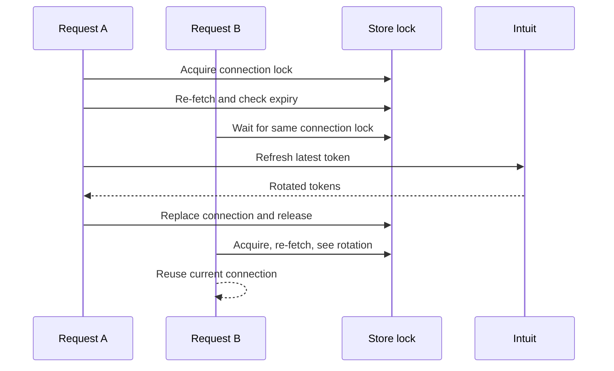

# Data flow

All application traffic follows a same-origin browser-to-Rails boundary. Rails is the only QuickBooks client,
and connection state exists only in the current Rails process.

## OAuth connection



The browser never receives the token response. Production selection fails closed.

## GET through Swagger



A GET may refresh once and retry once after a 401. It never writes accounting data.

## POST through Swagger



Cancellation, a missing CSRF token, or a cross-origin target is blocked before the network request. The OpenAPI
document has no OAuth/bearer scheme.

Rails performs no application-level duplicate-name query before create. Every confirmed execution is a new
operation with a new QBO `requestid` and can create a duplicate.

If the QBO POST times out or has another ambiguous transport failure, Rails does not retry and does not claim
whether the entity exists. There is no local uncertain state; inspect QuickBooks before deciding to retry.

## Concurrent refresh and disconnect



Disconnect shares this lock, revokes the latest refresh token, and deletes the value before releasing it.

## Connection loss

When the Rails process restarts, reloads, or loses the cache entry:

```json
{
  "error": {
    "code": "quickbooks_reconnect_required",
    "message": "The QuickBooks sandbox connection is missing or expired. Reconnect QuickBooks."
  }
}
```

The API returns HTTP 401. No database fallback or migration exists.
