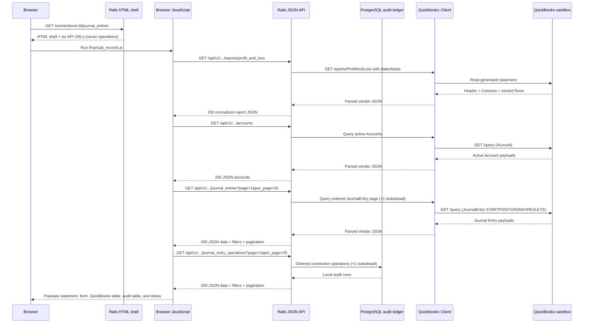
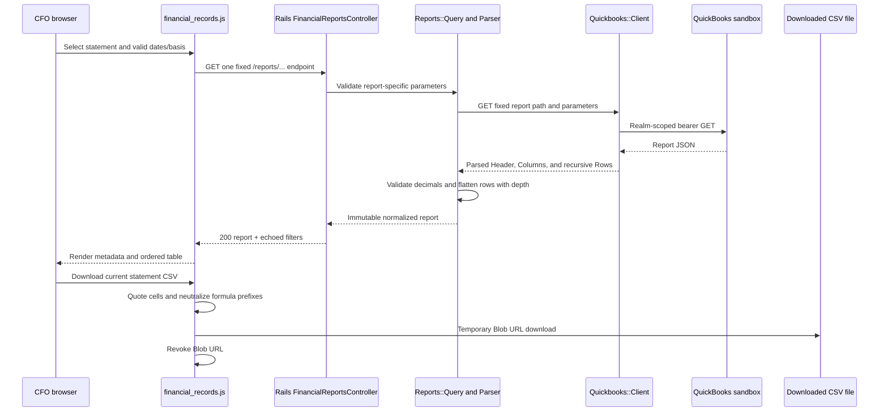
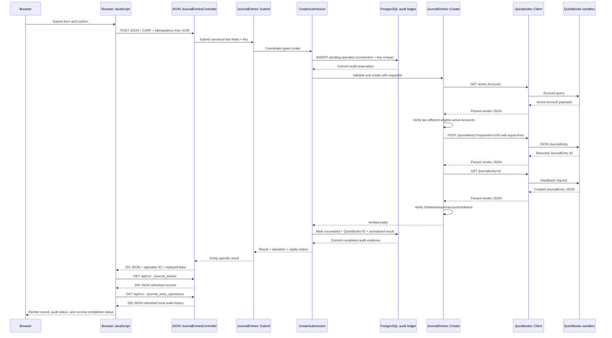
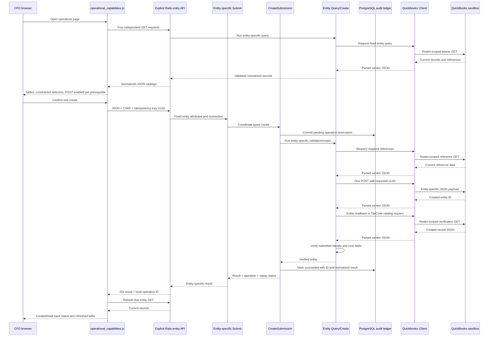
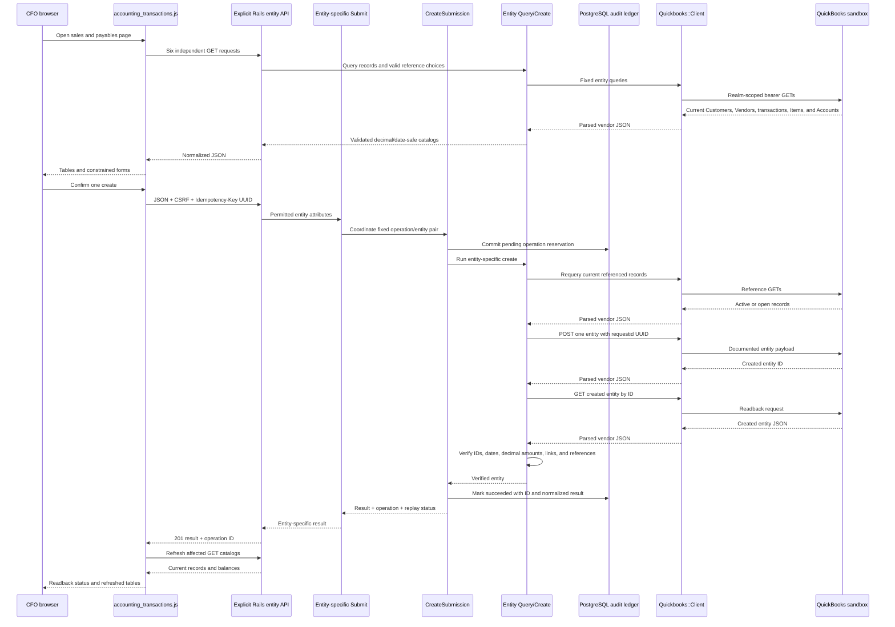
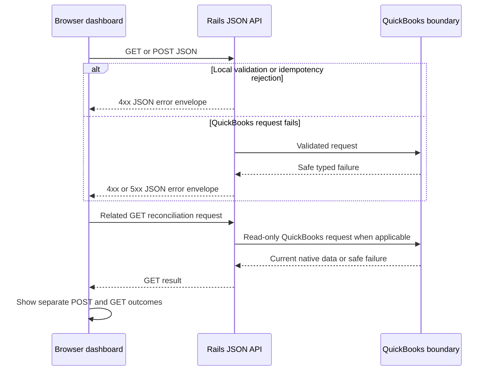

# Data flow

## Open the financial records dashboard



## Select and export a financial statement



Profit & Loss and Cash Flow use inclusive periods capped at six calendar months. Balance Sheet accepts one as-of
date. Only Profit & Loss and Balance Sheet accept Cash/Accrual. Report money cells remain strings from QuickBooks;
neither Rails nor JavaScript calculates statement totals, and no report payload is persisted.

## Filter, paginate, and export read-only data

```mermaid
sequenceDiagram
  participant B as CFO browser
  participant J as financial_records.js
  participant A as Rails read APIs
  participant Q as QuickBooks sandbox
  participant D as PostgreSQL audit ledger
  participant M as Loaded in-memory pages
  participant F as Downloaded CSV file
  B->>J: Apply inclusive transaction dates
  J->>A: GET both page 1 URLs with txn_date_from/to
  A->>Q: Filter/order QuickBooks JournalEntry query
  A->>D: Filter/order connection audit query
  Q-->>A: Journal Entry page
  D-->>A: Audit page
  A-->>J: Independent data + pagination metadata
  J-->>B: Render filtered page 1 for both tables
  B->>J: Load more for one table
  J->>A: GET only that source's next_page
  A-->>J: Next data page + pagination metadata
  J->>M: Append records and de-duplicate by ID
  J-->>B: Render all loaded pages
  B->>J: Apply memo / audit status
  J->>M: Derive visible records without mutation
  M-->>J: Filtered Journal Entries and audit operations
  J-->>B: Render visible rows; no API request
  B->>J: Download a visible-data CSV
  J->>J: Quote cells and neutralize formula prefixes
  J->>F: Temporary Blob URL download
  J->>J: Revoke Blob URL
```

Transaction-date changes are server reads: the QuickBooks API filters native `TxnDate`, while PostgreSQL filters
the original submitted `request_payload.txn_date`. Memo and audit-status changes remain browser-only across the
pages loaded so far. Journal Entry CSV uses one row per debit/credit line; audit CSV uses one row per operation.
Both contain visible loaded rows only. Decimal strings and ISO 8601 source values are copied without financial
calculation.

## Post one financial record



The Journal Entry is a real posting transaction. Its debit and credit effects depend on the selected QuickBooks
account types. QuickBooks remains the accounting source of truth. Rails stores the original canonical request,
request digest, status, QuickBooks entity ID when known, and normalized successful result as audit/idempotency
evidence; this is not a second accounting ledger.

For an existing key, Rails compares the request digest before any QuickBooks call. A matching `succeeded` row is
returned from the stored result with HTTP 200 and `replayed: true`. A different digest or a
`pending`/`rejected`/`uncertain` row returns HTTP 409. This conservative refusal requires human reconciliation
instead of guessing after an interrupted or ambiguous external write.

## OAuth/token storage

OAuth uses the existing encrypted/signed Rails session for temporary state and Active Record Encryption for persisted access/refresh tokens. A token refresh may update only the local `quickbooks_connections` row. Financial records remain in QuickBooks.

## Read and create workforce, tax, or inventory data



Employee and TimeActivity are payroll-adjacent Accounting API records, not payroll processing. Tax create is
limited to a TaxCode using an existing TaxRate. Inventory create uses existing eligible Accounts; it does not
create purchases, sales, or adjustments. The common coordinator manages only idempotency/audit state. Every
payload, current-reference check, and readback rule remains in the entity namespace.

## Read and create customers, vendors, sales, or payables



Customer and Vendor are non-posting list records. Invoice and Bill create one accounting line. Payment and
BillPayment apply one decimal amount to one freshly reloaded open source transaction and cannot exceed its
balance.

## Open API documentation

`GET /api-docs` renders a separate Swagger UI page. It fetches `GET /api-docs/openapi.yaml`, which describes the
twenty-nine CFO JSON operations and `GET /health`. Swagger can execute only documented GET operations. All eleven
POST operations are visible but their execution controls are disabled so API exploration cannot create records.

## Dashboard API failure



Initial Profit & Loss, Accounts, Journal Entries, and local audit-history requests settle independently, so every
failed source can be named while successful sections still render. A report failure marks only the statement
table unavailable. An Accounts failure keeps POST disabled. An audit-history failure marks only its table
unavailable. Safe transient GET failures are retried once after 500 ms. A POST failure preserves the user's form
values, refreshes the related GET projection, and explicitly warns the user to check QuickBooks before retrying
when the external transaction status may be uncertain. No POST is automatically retried.
