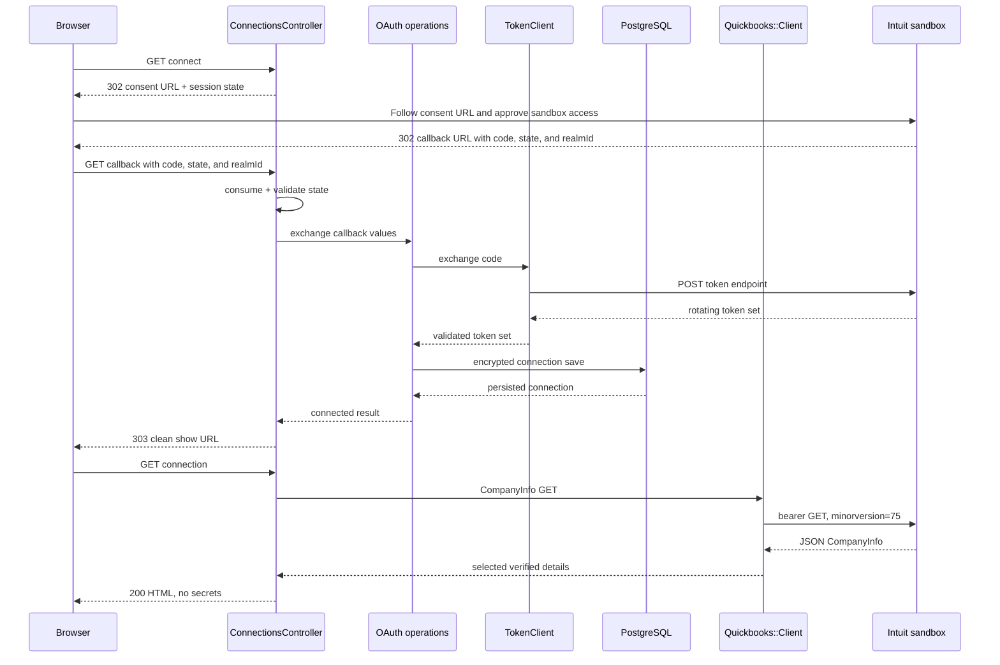

# Phase 01 — QuickBooks OAuth and read-only company connection

Completed locally: 2026-07-14
Ruby: 3.4.6
Rails: 8.1.3
PostgreSQL: 16.11
Faraday: 2.14.3

## A. Phase objective

Phase 1 adds the secure connection boundary between Rails and one or more QuickBooks Online sandbox companies. A developer can start Intuit consent, return through a state-protected callback, exchange the code, store encrypted rotating tokens, read the selected company's CompanyInfo, refresh an expired token once, and revoke/clear the connection.

This phase teaches four boundaries:

1. Rails owns browser/session security and encrypted persistence.
2. Focused OAuth operations coordinate token exchange/revocation without putting network calls in a model or controller.
3. One reusable `Quickbooks::Client` owns Accounting API transport, bearer/refresh behavior, safe errors, and instrumentation.
4. Entity-specific code (`CompanyInfo::Fetch`) validates entity response meaning without leaking that logic into transport.

Intentionally absent: accounting writes, chart-of-account queries, mappings, inbound financial JSON, inbound API bearer authentication, sync/idempotency records, background jobs, reconciliation, production QuickBooks calls, and automated tests.

## B. Accounting meaning

OAuth authorization and CompanyInfo are infrastructure/company-metadata operations. They create no customer, vendor, account, item, or transaction. They do not post to the general ledger.

- Debits: none.
- Credits: none.
- Posting status: non-posting.
- Reports that should change: none.
- Reports that should not change: Profit and Loss, Balance Sheet, Cash Flow, Trial Balance, General Ledger, Accounts Receivable ageing, and Accounts Payable ageing.

Company country, fiscal-year start, subscription status, and time zone are observed so later phases do not assume locale, currency, tax, or plan behavior. Reading those settings does not modify them.

## C. Rails pattern and reference review

### Selected pattern

- Conventional Active Record model for encrypted persisted authorization state and state-transition methods.
- Standard encrypted/signed CookieStore session for a small one-time OAuth state value with an application-enforced ten-minute expiry.
- Thin RESTful browser controller for redirects, session handling, CSRF-protected disconnect, and safe presentation.
- Focused plain Ruby operations for code exchange, disconnect, and CompanyInfo retrieval.
- One QuickBooks-specific Faraday Accounting API client and one narrow OAuth transport collaborator.
- Immutable `Data` values for token responses and selected CompanyInfo fields.
- Rails parameter filtering and Active Support notifications for redaction/observability.

This is idiomatic because Rails performs the work it already supports—sessions, redirects, CSRF, encryption, validations, database constraints, model filtering, autoloading, and instrumentation—while plain objects appear only where an external/network responsibility needs a stable boundary. There is no generic `ApplicationService`, repository, result framework, SDK wrapper, or custom dependency container.

### Official Rails references checked

- [Active Record Encryption](https://guides.rubyonrails.org/active_record_encryption.html), plus Rails 8.1.3 `active_record/railtie.rb`, `active_record/encryption/config.rb`, and `active_record/encryption/auto_filtered_parameters.rb`.
- [Action Controller Overview](https://guides.rubyonrails.org/action_controller_overview.html), [Securing Rails Applications](https://guides.rubyonrails.org/security.html), and [`ActiveSupport::SecurityUtils`](https://api.rubyonrails.org/classes/ActiveSupport/SecurityUtils.html).
- Installed Rails 8.1.3 autoload/initialization conventions.

### Official Intuit and HTTP references checked

- [OAuth 2.0 setup](https://developer.intuit.com/app/developer/qbo/docs/develop/authentication-and-authorization/oauth-2.0) and [OAuth FAQ](https://developer.intuit.com/app/developer/qbo/docs/develop/authentication-and-authorization/faq).
- Intuit production/sandbox OAuth discovery documents.
- [Create basic requests](https://developer.intuit.com/app/developer/qbo/docs/get-started/create-a-request), [REST API features](https://developer.intuit.com/app/developer/qbo/docs/learn/rest-api-features), [API Explorer introduction](https://developer.intuit.com/app/developer/qbo/docs/get-started/get-started-with-the-api-explorer), and [minor versions](https://developer.intuit.com/app/developer/qbo/docs/learn/explore-the-quickbooks-online-api/minor-versions).
- [Faraday documentation](https://lostisland.github.io/faraday/) and installed Faraday 2.14.3.

### Mature Rails implementations inspected

- Discourse at `939248f3690e3557207a3e4cd90bb7760201d4b0`: `app/controllers/users/omniauth_callbacks_controller.rb`, `plugins/discourse-oauth2-basic/lib/oauth2_basic_authenticator.rb`, and `plugins/discourse-oauth2-basic/lib/omniauth/strategies/oauth2_basic.rb`.
- Mastodon at `d70f1f983c945b3aa4c2089e540c67d706d762d9`: `app/lib/request.rb`.

Adopted: callback delegation, temporary session flow state, form-encoded token exchange, a centralized network boundary, explicit timeouts, and normalized failures.

Adapted: Discourse needs a configurable multi-provider OmniAuth framework and Mastodon needs arbitrary-host federation protections. This project retains their useful boundary shapes but writes a much smaller Intuit-specific flow with fixed hosts.

Rejected: disabling OAuth state verification, logging token request/response bodies, OmniAuth/QuickBooks SDKs, generic HTTP-client inheritance, Mastodon's proxy/DNS/signature machinery, callbacks that refresh tokens, and transactions spanning remote requests.

The selected pattern is appropriate for one vendor, one read entity, and low-volume developer use. Revisit it when multiple processes create measurable refresh races, when synchronous request time becomes user-visible, or when three or more real entity flows reveal stable repeated entity orchestration. Do not change it merely because a large repository has more layers.

Full evidence and decisions are in `docs/reference_review.md`, `docs/references.md`, and ADR 0002.

## D. Request lifecycle

One successful connection/show lifecycle is:

```text
browser GET connect
  -> Rails route
  -> ConnectionsController#connect
  -> random state in encrypted/signed session
  -> Intuit consent redirect
  -> callback with code/state/realmId
  -> one-time constant-time state validation
  -> Oauth::ExchangeAuthorizationCode
  -> Oauth::TokenClient
  -> Intuit token endpoint
  -> QuickbooksConnection encrypted persistence
  -> redirect to clean show URL
  -> CompanyInfo::Fetch
  -> Quickbooks::Client#get
  -> QuickBooks sandbox CompanyInfo
  -> returned Id must match realm
  -> selected metadata rendered without tokens
```



The remote token and CompanyInfo calls are never inside a database transaction. If expiry or the first 401 requires refresh, the client calls Intuit, then takes only a short row lock to conditionally persist the latest tokens, then makes/retries the GET at most once.

## E. File-by-file explanation

Each row includes purpose, caller, callees, input/output, persistence/network/side effects, placement/reuse, Rails convention, and reference influence.

### Runtime and persistence

| File | Why / caller | Calls | Input → output | Database | External call | Other side effect | Why here / reuse | Rails convention / reference |
|---|---|---|---|---|---|---|---|---|
| `Gemfile` | Declares direct HTTP dependency; Bundler reads it | Faraday 2.14 | Gem constraint → resolved dependency | None | Rubygems during install only | Bundle changes | Runtime dependency belongs in conventional manifest; reusable transport dependency | Rails-generated Gemfile retained; ADR 0002/Faraday docs |
| `Gemfile.lock` | Pins Faraday 2.14.3 and adapter graph; Bundler reads it | Resolved gems | Dependency graph → reproducible install | None | None at runtime | None | Conventional lockfile | Bundler/Rails default |
| `db/migrate/20260714182653_create_quickbooks_connections.rb` | Defines first domain table; migration task calls it | Active Record schema DSL | Empty schema → connection table/indexes/checks | Creates table, two indexes, seven checks | None | Schema change | Short reversible generated migration, phase-specific | Rails migration + critical DB-constraint guidance |
| `db/schema.rb` | Canonical generated current schema; Rails schema tasks read it | Active Record schema DSL | Database schema → loadable Ruby schema | Mirrors connection table | None | Regenerated by migration | Framework-generated, never hand-edited | Rails default |
| `app/models/quickbooks_connection.rb` | Owns persisted auth invariants; OAuth operations/client/controller call it | Active Record Encryption and persistence | Token set/state → saved record; predicates/serializable hash | Reads/updates one row; no network transaction | None | Encrypts/decrypts token attributes | Model behavior is tightly coupled to persisted state; reusable for all later entities via connection scope | Active Record model/encryption; no external model callbacks |
| `config/application.rb` | Maps injected encryption values onto Rails config; Rails boot calls it | Rails application configuration | Optional env keys → AR encryption config overrides | Enables encrypted model access | None | Boot configuration | Credentials remain default; environment is deployment override | Rails 8.1 railtie source |

### QuickBooks infrastructure and operations

| File | Why / caller | Calls | Input → output | Database | External call | Other side effect | Why here / reuse | Rails convention / reference |
|---|---|---|---|---|---|---|---|---|
| `app/services/quickbooks/error.rb` | Stable sanitized boundary errors; all QuickBooks objects raise, controller maps | `StandardError` | Message/code/status/details → typed exception | None | None | Carries safe metadata | Shared QuickBooks boundary, shallow hierarchy | Explicit errors; no result framework |
| `app/services/quickbooks/configuration.rb` | Validates credentials, encryption, environment, redirect, minor version, timeouts, fixed hosts; clients/controller call | Rails credentials/env, URI, AR Encryption config | Runtime settings/state → validated values or configuration error | None | None | Hard-fails non-sandbox | Cross-cutting QuickBooks-specific config; reusable | Rails credentials/config; Intuit fixed endpoints/security |
| `app/services/quickbooks/oauth/token_set.rb` | Converts token JSON into immutable typed values; TokenClient calls | `Data`, time parsing | Response Hash → token strings + absolute expiries | None | None | None | OAuth response value, reusable for exchange/refresh | Ruby 3.4 `Data`; explicit boundary contract |
| `app/services/quickbooks/oauth/token_client.rb` | Owns token/refresh/revoke HTTP; exchange, disconnect, main client call | Faraday, JSON, Base64, notifications | Code/refresh/revoke token → TokenSet/true or normalized error | None | Intuit token/revocation endpoints | Emits sanitized OAuth event | Separate because OAuth host/auth/body differ from Accounting API; reusable | Faraday direct REST; Intuit OAuth docs; Discourse adaptation |
| `app/services/quickbooks/oauth/exchange_authorization_code.rb` | Coordinates callback exchange and persistence; controller calls | TokenClient, QuickbooksConnection | `code`, `realm_id` → active connection | Insert/update after remote success | Token exchange via collaborator | May reconnect same realm | Domain-named operation keeps controller HTTP-only | Focused operation, no generic service base |
| `app/services/quickbooks/oauth/disconnect.rb` | Coordinates revoke then clear; controller calls | TokenClient, QuickbooksConnection | Connection → disconnected connection | Clears tokens/status after 200 | Intuit revoke via collaborator | Idempotent if already disconnected | Explicit destructive authorization operation | Remote-before-local, no spanning transaction |
| `app/services/quickbooks/client.rb` | Central Accounting API transport; CompanyInfo and future operations call | Faraday, TokenClient, connection, notifications | Relative GET path/params → parsed JSON Hash or normalized error | Reads token; short conditional locked refresh update | QuickBooks sandbox GET; token refresh via collaborator | Emits safe request event; max one retry | Reusable QuickBooks infrastructure, no entity/accounting policy | Intuit REST; Mastodon boundary adaptation; ADR 0002 |
| `app/services/quickbooks/company_info/details.rb` | Holds selected display fields; Fetch creates, controller/view consume | Ruby `Data` | CompanyInfo Hash → immutable Details | None | None | None | Entity-specific translation prevents mystery hashes in UI | Small explicit return contract |
| `app/services/quickbooks/company_info/fetch.rb` | Owns CompanyInfo endpoint/identity check; controller calls | Quickbooks::Client, Details | Connection → verified Details | None directly | CompanyInfo GET through client | Rejects realm mismatch | Entity-specific operation; transport remains reusable | Intuit single-entity read/API Explorer |

### HTTP and presentation

| File | Why / caller | Calls | Input → output | Database | External call | Other side effect | Why here / reuse | Rails convention / reference |
|---|---|---|---|---|---|---|---|---|
| `config/routes.rb` | Exposes RESTful list/show/connect/callback/disconnect; router reads | ConnectionsController actions | HTTP method/path → action | None | None | Route helpers | Conventional explicit routing | Rails resources/namespace |
| `app/controllers/quickbooks/connections_controller.rb` | Owns session, redirects, dashboard guard, safe error presentation; router calls | Configuration, OAuth operations, CompanyInfo operation, model | Browser params/session → redirect or HTML assigns | Bounded list/find; operations persist | Only through operations/client | State cookie, flash, cache/referrer headers, safe warnings | Browser HTTP concerns belong in controller; CompanyInfo errors remain visible | Rails sessions/CSRF/redirects; Discourse callback shape |
| `app/views/quickbooks/connections/index.html.erb` | Shows configuration status and latest 20 connections; controller renders | Rails helpers and safe model metadata | Assigned records/error → HTML | No direct query beyond relation evaluation | None | None | Development-only ERB status UI; no token fields | Rails views; no frontend framework |
| `app/views/quickbooks/connections/show.html.erb` | Shows verified CompanyInfo and disconnect action; controller renders | Rails helpers, Details, safe model metadata | Connection/details/error → HTML | None directly | None | CSRF-protected DELETE form | Entity display belongs in view; tokens never referenced | Rails ERB/button_to/Turbo confirm |
| `config/initializers/filter_parameter_logging.rb` | Redacts callback/auth/encryption-sensitive names; Rails logging calls | Rails parameter filter | Parameter hash → filtered logs | None | None | Changes logging | Global security filter belongs in standard initializer | Rails generated initializer + security guide |
| `config/initializers/quickbooks_instrumentation.rb` | Converts notification events to sanitized structured logs; Rails boot subscribes | ActiveSupport::Notifications, Rails logger | Event metadata → one JSON log line | None | None | Info log without bodies/tokens | Shared observability at initializer boundary | Active Support instrumentation; Intuit `intuit_tid` |

### Documentation

| File | Why / caller | Calls | Input → output | Database | External call | Other side effect | Why here / reuse | Convention / reference |
|---|---|---|---|---|---|---|---|---|
| `README.md` | Current setup/operation entry point; developers read | Links to detailed docs | Project state → runnable setup | None | None | None | Repository overview | Required project artifact |
| `docs/engineering_principles.md` | Adds durable allowlisted-host, rotated-token, and no-body-log rules | Nothing | Decisions → future implementation constraints | None | None | None | Durable rules, not temporary detail | Master task policy |
| `docs/reference_review.md` | Records exact Rails/Intuit/mature implementation research and adoption decision | Links/source paths | Evidence → architecture rationale | None | None | None | Phase evidence log | Required format |
| `docs/references.md` | Records official Intuit behaviors, dates, uncertainty, restrictions | Official links | Sources → verified capability notes | None | None | None | QuickBooks source of truth | Required artifact |
| `docs/architecture.md` | Defines current boundaries/dependencies/security/deferred options | Links/diagrams | Implementation → system model | None | None | None | Evolving architecture view | Required artifact |
| `docs/data_flow.md` | Traces OAuth/read/refresh/disconnect/health | Mermaid | Actions → sequence descriptions | None | None | None | Implemented flows only | Required artifact |
| `docs/data_dictionary.md` | Documents every connection field/constraint/security class/retention | Schema/model | Table → data governance reference | None | None | None | Database source companion | Required artifact |
| `docs/qbo_capability_matrix.md` | Marks CompanyInfo as documentation-verified/read-only and leaves future entities unverified | Official source reference | Capability → status row | None | None | None | Prevents invented support claims | Required artifact |
| `docs/decisions/0002_direct_quickbooks_rest_client.md` | Captures hard-to-reverse SDK/direct-client decision and revisit triggers | Evidence links | Context/options → accepted decision | None | None | None | Appropriate lightweight ADR | Required ADR policy |
| `docs/api_examples/company_info.md` | Sanitized concrete local/upstream/readback example; developers use manually | Dashboard/API Explorer | Steps → expected non-posting result | Read-only inspection | Manual CompanyInfo GET | None | Entity-specific example | Required API examples |
| `docs/phase_status.md` | Declares Phase 1 completion/validation/blockers/next command | Links phase doc | Phase evidence → handoff state | None | None | Stops continuation | Persistent session handoff | Required artifact |
| `docs/phases/01_quickbooks_oauth.md` | Complete learning/validation record for this phase | All above | Work performed → auditable explanation | None | None | None | Phase-specific source of truth | Required A–L phase document |

## F. Important code walkthrough

### 1. `Quickbooks::Configuration#validate!` — public

- Parameters: none; reads Rails credentials/environment.
- Returns: the configuration object.
- Failures: `Error::Configuration` for production/unknown environment, missing client values, unsafe redirect, missing encryption keys, minor version below 75, or timeout outside allowed ranges.
- Database/external: none.
- Called by: controller authorization URL, OAuth token client, and Accounting API client before sensitive work.
- Must not be called by: entity payload builders (none exist yet).
- Location rationale: all QuickBooks-specific fixed hosts and safe deployment rules are centralized without inventing generic application configuration.

### 2. `ConnectionsController#connect` — public action

- Parameters: browser request/session.
- Returns: HTTP 302 to Intuit.
- Behavior: generates 32 random URL-safe bytes, stores value plus ten-minute epoch expiry in encrypted/signed CookieStore, and builds the accounting-scope authorization URL.
- Database/external: no database query and no server-to-server call; the browser follows the redirect.
- Failures: missing/unsafe configuration becomes a sanitized 303 back to the list.
- Must be called by: the named Rails route. It is not an application service API.

### 3. `ConnectionsController#validate_oauth_state!` — private

- Parameters: implicitly reads callback `state` and session.
- Returns: true-by-continuation; otherwise raises `Error::Authentication`.
- Behavior: deletes the session entry first, validates presence/expiry, and uses `ActiveSupport::SecurityUtils.secure_compare`.
- Database/external: none.
- Why needed: prevents login/authorization CSRF and replay. It runs before denial or code exchange so even failure callbacks require the originating browser flow.
- Must not be called outside callback processing.

### 4. `Oauth::ExchangeAuthorizationCode#call(code:, realm_id:)` — public

- Parameters: callback authorization code and realm ID strings.
- Returns: persisted `QuickbooksConnection`.
- Validation: code present and no more than 512 bytes; realm numeric and 1–255 digits.
- External: calls token exchange first.
- Database: finds/initializes the environment-scoped realm and persists encrypted token state after remote success. It does not wrap the HTTP call in a transaction.
- Failures: normalized OAuth errors, model validation/database errors, or a sanitized connection conflict on a uniqueness race.
- Called by: callback action only. Models and views must not call it.

### 5. `Oauth::TokenClient#exchange`, `#refresh`, and `#revoke` — public

- Parameters: one code, refresh token, or revoke token.
- Returns: immutable `TokenSet` for exchange/refresh; `true` for successful revoke.
- External: fixed Intuit endpoints with Basic credentials. Exchange/refresh are form-encoded; revoke is JSON. No Faraday logger middleware is configured.
- Database: none.
- Failures: timeout (504 intent), network/SSL or 5xx unavailable (503), rate limit (429), authentication (401 intent), malformed successful JSON/unexpected token response (502).
- Called by: focused OAuth operations and `Quickbooks::Client` refresh. Controllers/models must not call Faraday or construct these requests.

### 6. `TokenSet.from_payload` — public class method

- Parameters: parsed token response and optional clock.
- Returns: immutable token values plus absolute access/refresh expiry times.
- Failures: `Error::UnexpectedResponse` if access token, refresh token, or positive access lifetime is missing.
- Database/external: none.
- Location rationale: token parsing is OAuth boundary behavior and gives model transitions an explicit contract instead of a mystery hash.

### 7. `QuickbooksConnection#store_authorization!`, `#store_refreshed_tokens!`, and `#mark_disconnected!` — public model transitions

- Parameters: `TokenSet`, requested scopes, or none.
- Returns: Active Record update result (truthy) while mutating the receiver.
- Database: encrypts/persists latest tokens and expiries; refresh records `last_refreshed_at`; disconnect clears token/expiry columns and sets status/time.
- External: none.
- Failures: Active Record validation/constraint/locking failures.
- Called by: OAuth exchange, client refresh, and disconnect operation. They should not be called by views or arbitrary callbacks.
- Location rationale: the changes express invariants of the persisted record. The model does not decide when to make an external request.

### 8. `Quickbooks::Client#get(path, params: {})` — public

- Parameters: application-controlled relative path and optional query Hash.
- Returns: parsed JSON Hash.
- Validation: configuration, active/matching environment connection, and restricted relative path.
- External: one sandbox GET, plus at most one token refresh and one retried GET.
- Database: may conditionally update rotated token state through `refresh_access_token!`.
- Failures: typed QuickBooks errors for auth/authorization/validation/not found/conflict/rate limit/timeout/unavailable/malformed/unexpected responses.
- Called by: entity operations such as CompanyInfo. Controllers, models, validators, and future payload builders must not call Faraday; controllers should call an entity operation.
- Location rationale: it is the reusable vendor transport boundary and deliberately contains no CompanyInfo or accounting rule.

### 9. `Quickbooks::Client#refresh_access_token!` — private

- Parameters: implicit connection/token collaborator.
- Returns: reloaded connection state.
- External: refresh request occurs before a lock/transaction.
- Database: `with_lock` reloads the row and accepts the response only if both stored access and refresh credentials still equal those used to initiate the refresh; then reloads for the following request.
- Concurrency behavior: a concurrent successful refresh causes the stale response to be discarded. If another refresh already replaced the token while this call received `invalid_grant`, the reloaded newer state is accepted. Duplicate remote calls can still begin across processes.
- Called only by `get`; public callers cannot create an infinite refresh loop.

### 10. `CompanyInfo::Fetch#call` — public

- Parameters: initialized connection.
- Returns: immutable `CompanyInfo::Details`.
- External: asks the reusable client for `companyinfo/<realm_id>`.
- Database: none directly.
- Failures: all client errors plus `Error::UnexpectedResponse` if `CompanyInfo` is not an object or its `Id` differs from the connection realm.
- Called by: connection show action. The low-level client should not perform this identity rule because it is entity-specific.

### 11. `Oauth::Disconnect#call` — public

- Parameters: initialized connection.
- Returns: disconnected connection.
- External: revokes the refresh token unless already disconnected.
- Database: only after successful revoke, clears tokens and sets disconnected state.
- Failure window: if remote success occurs but local update fails, Intuit is revoked while the local row still appears active; a later request fails auth and the developer may reconnect or clear it deliberately. If remote revoke fails, local tokens remain for retry.
- Called by: CSRF-protected DELETE action only.

## G. Validation performed

No automated tests were created, modified, or run.

### Dependency and syntax

- `bundle install` resolved Faraday 2.14.3 and `faraday-net_http` 3.4.4 after network permission was granted.
- `bundle check` result: `The Gemfile's dependencies are satisfied`.
- `bundle info faraday --path` resolved `faraday-2.14.3` under Ruby 3.4.6.
- Ruby syntax was checked for every `.rb` file under `app`, `config`, and `db/migrate` using the rbenv Ruby. Final result: every file reported `Syntax OK`.

### Database

- Initial sandboxed `bin/rails db:prepare` could not open `/tmp/.s.PGSQL.5432` (`Operation not permitted`). It was rerun with approved local-socket access.
- Migration completed; table, indexes, and all seven checks were created. `db:prepare` emitted successful migration blocks for its configured current databases.
- `bin/rails db:migrate:status` result:

  ```text
  database: qbo_cfo_bridge_development
  up  20260714182653  Create quickbooks connections
  ```

- A rolled-back Rails runner inspection created a temporary connection with non-production validation keys, queried raw PostgreSQL token columns, verified neither contained the plaintext marker, verified serialization omitted both sensitive names, transitioned to disconnected, verified tokens cleared, and rolled the transaction back. Result:

  ```text
  Encrypted persistence, redacted serialization, and disconnect clearing verified
  ```

No validation record remains.

### Boot, autoload, routes, lint, and security scan

- `bin/rails runner 'puts "Rails booted successfully"'` → `Rails booted successfully`.
- `bin/rails zeitwerk:check` → `All is good!`.
- `bin/rails routes -g quickbooks` showed exactly five routes: connect GET, callback GET, disconnect DELETE, connections GET, and connection GET.
- `bin/rubocop` with a writable temporary cache → `36 files inspected, no offenses detected`.
- The generated `bin/brakeman` could not complete its forced online latest-version check in the restricted environment and raised inside `ensure_latest`. Running the installed scanner directly with `bundle exec brakeman --no-pager` completed 79 checks: `Errors: 0`, `Security Warnings: 0`.
- Configuration guard runner with `QUICKBOOKS_ENV=production` → `Production guard: quickbooks_environment_not_sandbox`.

### Manual local HTTP requests

A temporary Rails 8.1.3/Puma 8.0.2 server ran with dummy local credentials and non-production encryption keys at `127.0.0.1:3101`.

- `GET /quickbooks/connections` → HTTP 200; page contained the dashboard heading and “No sandbox company has been connected”; dummy client/secret/key markers were absent.
- `GET /quickbooks/connections/connect` → HTTP 302. Parsed Location was exactly `https://appcenter.intuit.com/connect/oauth2`; query keys were exactly `client_id,redirect_uri,response_type,scope,state`.
- Forged `GET /quickbooks/connections/callback?state=...&code=...&realmId=123` without the session → HTTP 303 back to `/quickbooks/connections`.
- Observed Rails log showed callback `state` and `code` as `[FILTERED]`; no access token, refresh token, client secret, Authorization header, or body was logged.
- Server was gracefully stopped after inspection.

### External validation status

Live sandbox validation was completed on 2026-07-15 after the developer supplied credentials through encrypted Rails credentials and signed in directly to Intuit. The development callback URI was registered in the Intuit app without exposing the client secret.

Observed results:

- Authorization-code exchange returned HTTP 200 and persisted one active, encrypted sandbox connection.
- The realm-scoped CompanyInfo GET returned HTTP 200 and its visible company metadata matched the company selected on Intuit's consent page.
- Live evidence corrected an earlier assumption: `CompanyInfo.Id` is an entity ID and did not equal the OAuth realm ID. The operation now requires a nonblank CompanyInfo entity ID while realm isolation remains enforced by the connection and request path.
- Forcing only the local access expiry produced one successful refresh event followed by one successful CompanyInfo GET; the stored expiry moved forward.
- Revocation returned HTTP 200, the local row became disconnected, and token/expiry fields were cleared.
- A final consent flow reconnected the same sandbox successfully, leaving the connection active for the next explicitly authorized phase.
- No QuickBooks accounting write was sent. No automated tests were created or run.

**QuickBooks sandbox validation: PASS.** The steps below remain the repeatable validation runbook.

## H. Manual sandbox validation

**COMPLETED on 2026-07-15; retained as a repeatable manual runbook**

### Prerequisites and configuration

1. In the Intuit Developer Portal, create/select a QuickBooks Online app and a sandbox company.
2. Under Development Keys & OAuth, register exactly:

   ```text
   http://localhost:3000/quickbooks/connections/callback
   ```

3. Generate Active Record Encryption keys with `bin/rails db:encryption:init`; store them in encrypted Rails credentials or inject all three `ACTIVE_RECORD_ENCRYPTION_*` variables. Never commit or paste values into docs/logs.
4. Inject:

   ```text
   QUICKBOOKS_ENV=sandbox
   QUICKBOOKS_CLIENT_ID=<development client id>
   QUICKBOOKS_CLIENT_SECRET=<development client secret>
   QUICKBOOKS_REDIRECT_URI=http://localhost:3000/quickbooks/connections/callback
   QUICKBOOKS_MINOR_VERSION=75
   QUICKBOOKS_OPEN_TIMEOUT=5
   QUICKBOOKS_READ_TIMEOUT=10
   ```

5. Run:

   ```bash
   RBENV_VERSION=3.4.6 rbenv exec ruby bin/rails db:prepare
   RBENV_VERSION=3.4.6 rbenv exec ruby bin/rails server
   ```

### Connect and identity proof

1. Open `http://localhost:3000/quickbooks/connections` in the same browser used for the full flow. Use the same hostname as `QUICKBOOKS_REDIRECT_URI` so the encrypted OAuth-state cookie returns on callback. Expected: HTTP 200 and a Connect link; no token fields.
2. Select **Connect a QuickBooks sandbox**. Expected: HTTP 302 to `https://appcenter.intuit.com/connect/oauth2` with accounting scope and random state.
3. Sign in, choose one unmistakably named sandbox, and approve. Do not copy the callback URL because it contains a short-lived code.
4. Expected callback: Rails validates state, exchanges code, saves one connection, and returns HTTP 303 to `/quickbooks/connections/<local id>`.
5. Expected show request: HTTP 200 after one GET to:

   ```text
   https://sandbox-quickbooks.api.intuit.com/v3/company/<realm>/companyinfo/<realm>?minorversion=75
   ```

6. Verify the page says the realm-scoped CompanyInfo read succeeded and shows the correct company name. Compare country, fiscal-year start, subscription status, and default time zone with the sandbox's settings. Missing optional fields may display `—`.
7. Independently sign in to Intuit API Explorer, select the same sandbox, read CompanyInfo, and compare visible company metadata to Rails. Do not compare `CompanyInfo.Id` to the realm ID: it is the entity ID and may differ. This proves Rails connected to the intended company rather than only proving HTTP success.

### Safe local record inspection

Run a field allowlist that cannot print tokens:

```bash
RBENV_VERSION=3.4.6 rbenv exec ruby bin/rails runner '
  connection = QuickbooksConnection.order(:id).last
  puts connection.attributes.slice(
    "id", "realm_id", "environment", "status",
    "access_token_expires_at", "refresh_token_expires_at",
    "granted_scopes", "last_refreshed_at", "disconnected_at"
  )
'
```

Expected: sandbox environment, active status, matching numeric realm, expiry timestamps, accounting scope, and no token keys/output.

### Refresh and single retry proof

1. Record the connection's current `updated_at`, access expiry, and `last_refreshed_at` using the safe allowlist above.
2. Force only the local access expiry (sandbox validation only):

   ```bash
   RBENV_VERSION=3.4.6 rbenv exec ruby bin/rails runner '
     QuickbooksConnection.connected.order(:id).last.update_column(:access_token_expires_at, Time.current)
   '
   ```

3. Reload the connection page once. Expected: CompanyInfo still renders; one `oauth.quickbooks` refresh event and one `request.quickbooks` GET event appear; no 401 loop.
4. Inspect allowed fields again. Expected: later access expiry, non-null/later `last_refreshed_at`, and incremented `updated_at`. Never print token values to compare rotation.
5. Inspect `log/development.log` for event names/status/request ID/`intuit_tid`. Confirm no bearer value, OAuth code, refresh token, client secret, CompanyInfo JSON, or Authorization header appears.

### Denial/state proof

- Start a fresh Connect flow and choose Cancel/deny at Intuit. Expected: callback state is validated, no row/token change occurs, and Rails redirects to the list with a sanitized denial alert.
- Start a Connect flow in one private browser, then alter/remove the callback state or open it in a different private session. Expected: HTTP 303 back to the list with “invalid or expired”; no token endpoint call and no local connection change.

### Disconnect and cleanup

1. Use **Disconnect and revoke access** on the active page. Expected local request: CSRF-protected DELETE, remote revocation HTTP 200, then local HTTP 303.
2. Expected local row: `status=disconnected`, `disconnected_at` present, access/refresh token columns and expiries cleared.
3. Expected Intuit behavior: the app no longer has access; refreshing/reusing the old connection must fail and reconnect must require consent.
4. Optional after confirming revocation: remove only the disconnected local validation row in Rails console. Do not delete a still-active row as a substitute for revocation.

### Expected accounting/report result

No duplicate test data is created because CompanyInfo is read-only. No QuickBooks cleanup or reversal transaction exists or is needed. Capture before/after report timestamps only if desired; all financial report values must remain unchanged, with zero debit and zero credit effect.

## I. Failure scenarios

| Scenario | Behavior |
|---|---|
| Missing client ID/secret/redirect or encryption keys | Connect is blocked; dashboard shows a sanitized configuration message; no external call |
| Production/unknown `QUICKBOOKS_ENV` | Hard configuration failure before URL/client use |
| Unsafe redirect URI | Non-HTTPS is rejected outside localhost development; malformed/relative/userinfo/fragment URI rejected |
| OAuth denial | State is still consumed/validated; 303 with safe denial; no token persistence |
| Missing, wrong, expired, or replayed state | Constant-time validation fails; state is deleted; no token exchange |
| Missing/oversized code or nonnumeric/oversized realm | Authentication error before token exchange |
| Token endpoint 400/invalid grant | Normalized authentication error; raw body/token is not logged or rendered |
| OAuth 429 | Rate-limit error with 429 intent and safe code |
| OAuth/API timeout | Normalized timeout with 504 intent; no silent retry storm |
| DNS/connection/SSL failure or upstream 5xx | Normalized unavailable error with 503 intent, even if body is HTML/malformed |
| Successful status with malformed JSON/incomplete tokens | Unexpected-response error with 502 intent; nothing persisted |
| Missing/inactive/environment-mismatched connection | Authentication error before Accounting API request |
| Expired access token | One refresh before GET; latest token set conditionally persisted |
| First GET returns 401 | At most one refresh and one retried GET; second 401 becomes authentication error |
| Failed token refresh | Original request is not retried; connection stays for manual reconnect/troubleshooting |
| Concurrent refresh | Stale response cannot overwrite a changed refresh token; cross-process duplicate remote calls remain a documented limitation |
| API 403/404/409/429/5xx | Mapped respectively to authorization/not-found/conflict/rate-limit/unavailable errors |
| QuickBooks validation fault | Safe bounded `quickbooks_code`/fault type retained; upstream message/payload omitted |
| Malformed/error response | Successful malformed JSON becomes 502; error-status malformed body still maps by HTTP status |
| Unexpected CompanyInfo shape/ID mismatch | 502-style unexpected response; page does not assert identity |
| Database validation/constraint failure after token exchange | Safe persistence alert; no token is logged. The authorization may exist remotely and should be reconnected/revoked deliberately |
| Disconnect revoke failure | Local tokens/status remain active for retry; sanitized alert |
| Revoke succeeds but local clear fails | Remote access is revoked but local status may be stale; reconnect or deliberately clear after confirming Intuit state |

The current endpoints are developer HTML flows, so errors redirect/render safe messages rather than the future JSON API error envelope. Phase 4 will apply the stable JSON shape to versioned ingestion endpoints.

## J. Scale and maintenance review

- Assumption: a developer connects a handful of sandbox companies; connection/read requests are occasional and synchronous.
- Data volume: one row per environment/company, currently no child entities. Indexes cover unique realm lookup and status queries. Dashboard is capped at 20 rows, so no unbounded `.all` exists.
- Expensive queries: none at Phase 1 scale. The list does one bounded ordered query; show does one primary-key read and one remote GET.
- Pagination: not needed for the fixed 20-row development dashboard. Add cursor pagination if it becomes an operational connection console.
- Background jobs: not justified. Consent is browser-driven and CompanyInfo feedback should be immediate. Later high-latency/bulk work may use Active Job after synchronous semantics are understood.
- Concurrency: optimistic locking plus a short conditional row lock prevents stale token persistence. It does not stop two processes from starting refresh simultaneously; Intuit warns this can invalidate tokens. Before multi-process/background traffic, add a connection-scoped distributed single-flight lock and measure lock/refresh outcomes.
- Idempotency: reconnect uses unique `(environment, realm_id)` and updates the same row. Disconnect is locally idempotent after success. There are no QuickBooks writes or sync-operation idempotency records yet.
- Observability: sanitized OAuth/request events include duration, operation/method, connection/realm, local request UUID, retry flag, status, and `intuit_tid`; no headers/bodies/tokens.
- Ten times volume: current bounded queries remain fine; add rate/error metrics, dashboard pagination, and operational alerts before adding workers.
- One hundred times volume/multiple processes: distributed refresh serialization, connection-level authorization/multi-tenant ownership, retry/backoff policy for safe reads, and structured metrics become necessary. Do not generalize entity clients.
- Maintenance: recheck Intuit endpoints, token policy, and current minor version before production readiness and before relying on new entity fields. Keep Faraday updated within the compatible major version and re-run lint/security review.

## K. Rollback or cleanup

### Local rollback

- Before any real sandbox use, `bin/rails db:rollback STEP=1` removes the `quickbooks_connections` table. This destroys local encrypted authorization state and should not be used after connections exist without first revoking them.
- For one manually validated connection, first use the UI disconnect/revoke action. After Intuit confirms revocation, an operator may delete the disconnected row in Rails console if authorization history is not required.
- Never delete an active row merely to hide/forget tokens; remote authorization would remain.

### QuickBooks cleanup

- Use Disconnect to call Intuit's revocation endpoint, then clear local credentials.
- No QuickBooks entity or accounting transaction was created, so no entity deletion, void, reversal, or deactivation applies.
- Revoking app access does not change financial reports.
- If remote revoke succeeds but the local update fails, verify authorization in Intuit, then repair/delete the local row deliberately; no accounting reversal is involved.

No destructive cleanup was performed against a real sandbox during this phase because no credentials or live connection existed.

## L. What comes next

Phase 2 will reuse the same connection and `Quickbooks::Client` to read the chart of accounts and add connection-scoped `AccountMapping` records with validated constraints and bulk-lookup-aware design. It will not create or modify QuickBooks accounts.
