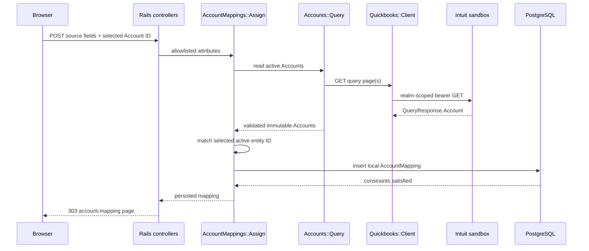

# Phase 02 — Read chart of accounts and create account mappings

> Historical record: the mapping experiment described here was completed and validated, then removed from the active product when the user simplified the requirement to direct Journal Entry GET/POST with existing QuickBooks Account dropdowns. The database table remains unused; the routes, controller, operation, view, and API example no longer exist.

Completed and live-validated: 2026-07-15
Ruby: 3.4.6
Rails: 8.1.3
PostgreSQL: 16.11
Faraday: 2.14.3

## A. Phase objective

Phase 2 adds a read-only chart-of-accounts view for the connected QuickBooks sandbox and a local, connection-scoped way to map source account codes to active QuickBooks accounts. It is needed because later transaction phases must resolve deliberate, validated account references instead of accepting arbitrary QuickBooks IDs or guessing from names.

The developer learns how a realm-scoped QuickBooks query is paginated, how entity response parsing stays outside the transport client, how a Rails model and PostgreSQL jointly protect mapping integrity, and how a future batch can resolve many source codes without an N+1 query.

Intentionally absent: QuickBooks Account creation/update/deactivation, any other QuickBooks write, journal entries, inbound JSON/authentication, synchronization/idempotency records, background jobs, production access, automatic name-based mapping, and automated tests.

## B. Accounting meaning

The QuickBooks Account records are existing chart-of-accounts master data. `AccountMapping` is integration metadata stored only in PostgreSQL. Reading Accounts or creating/removing a local mapping does not post an accounting record and does not alter QuickBooks.

- Debits: none.
- Credits: none.
- Posting status: non-posting.
- QuickBooks records changed: none.
- Local records changed: an `account_mappings` row may be inserted or deleted.
- Reports that should change: none.
- Reports that should not change: Profit and Loss, Balance Sheet, Cash Flow, Trial Balance, General Ledger, Accounts Receivable ageing, and Accounts Payable ageing.

An Account's classification/type controls where future postings appear, but merely reading or locally referencing that Account has zero financial-statement effect.

## C. Rails pattern and reference review

### Selected pattern

- A conventional `AccountMapping < ApplicationRecord` belongs to a `QuickbooksConnection`.
- Application validations provide useful form errors; a foreign key, non-null columns, check constraints, and a composite unique index enforce critical integrity under concurrency.
- A concrete `Quickbooks::Accounts::Query` owns Account query syntax, pagination, response validation, and immutable result mapping while reusing `Quickbooks::Client#get` for transport/authentication.
- A focused `Quickbooks::AccountMappings::Assign` operation performs the authoritative active-Account read before local persistence. The model has no callback or network behavior.
- Thin nested resource controllers expose one read page plus local create/delete actions.
- `AccountMapping.indexed_by_source_account_code` accepts a bounded set of source codes and returns an indexed Hash from one SQL query for the normal batch size.

This is idiomatic Rails because associations, validations, normalization, resource routing, form helpers, database migrations, foreign keys, and indexes remain standard Rails. The two plain Ruby objects exist only at the remote query/orchestration boundary. There is no repository layer, generic mapping framework, service base class, query-object framework, or callback-driven synchronization.

### Official Rails references checked

- [Active Record Associations](https://guides.rubyonrails.org/association_basics.html): `belongs_to`/`has_many`, indexed foreign keys, and database foreign-key constraints.
- [Active Record Validations](https://guides.rubyonrails.org/active_record_validations.html): presence/length/scoped uniqueness for application feedback, with the explicit warning that uniqueness validation does not create a database constraint.
- [Active Record Migrations](https://guides.rubyonrails.org/active_record_migrations.html): references, foreign keys, indexes, and reversible check constraints.
- Rails 8.1 application structure, RESTful nested resources, form helpers, and Zeitwerk naming conventions.

### Official Intuit references checked

- [Data queries](https://developer.intuit.com/app/developer/qbo/docs/learn/explore-the-quickbooks-online-api/data-queries): query endpoint/syntax, one-based `STARTPOSITION`, default 100 rows, maximum 1,000 rows, `MAXRESULTS`, and `QueryResponse` metadata.
- [REST API features](https://developer.intuit.com/app/developer/qbo/docs/learn/rest-api-features): query pagination, the 1,000-row response cap, and documented sandbox rate limits.
- [Accounts](https://developer.intuit.com/app/developer/qbo/docs/learn/learn-basic-bookkeeping/accounts): chart-of-accounts meaning, unique names, classification, account type, and account subtype/detail type.
- [Explore the QuickBooks Online Accounting API](https://developer.intuit.com/app/developer/qbo/docs/learn/explore-the-quickbooks-online-api): Account is a list entity; list queries return active records by default unless inactive records are requested.
- [Basic field definitions](https://developer.intuit.com/app/developer/qbo/docs/learn/learn-basic-field-definitions): company/realm IDs and entity IDs are different identifiers.
- [Minor versions](https://developer.intuit.com/app/developer/qbo/docs/learn/explore-the-quickbooks-online-api/minor-versions): minor version 75 remains the configured minimum.

The implementation uses the explicit statement `SELECT * FROM Account WHERE Active = true STARTPOSITION n MAXRESULTS 1000`. An explicit active predicate makes the mapping rule visible instead of relying on the list-entity default.

### Mature Rails repositories inspected

- Discourse, `main` at `b1daf27d84d556fb23e9c175e7b092a52eee0cf7`: `app/models/user_associated_account.rb` and the associated schema indexes. Observed a concrete external-account association model with `belongs_to` and composite database uniqueness for provider/external identity and provider/user identity.
- Mastodon, `main` at `d70f1f983c945b3aa4c2089e540c67d706d762d9`: `app/models/account_alias.rb` and the associated schema. Observed a small concrete alias/mapping model with `belongs_to`, normalization, scoped uniqueness, and non-null persisted fields.

Adopted: concrete domain naming, association ownership, normalization, scoped application uniqueness, and database integrity. Adapted: this project scopes source identity to QuickBooks connection plus source system and permits several source accounts to deliberately target one QuickBooks account. Rejected: generic polymorphic mappings, provider registries, model callbacks that resolve remote data, and copying application-specific authentication/federation behavior.

The selected pattern is sufficient for one mapping type and an occasional developer page. Reconsider only when several implemented mapping domains exhibit the same lifecycle, or when measured account volume/latency requires cached snapshots, cursor UI pagination, or background refresh. Similar names alone are not a reason to generalize.

## D. Request lifecycle

One mapping creation lifecycle is:

```text
browser POST nested account_mappings route
  -> AccountMappingsController#create
  -> strong parameter allowlist
  -> AccountMappings::Assign#call
  -> Accounts::Query#call
  -> Quickbooks::Client#get("query")
  -> one or more sandbox GET pages, 1,000 rows maximum each
  -> validate active Account response and selected entity ID
  -> connection.account_mappings.create!
  -> model normalization/validation
  -> PostgreSQL foreign key/checks/unique index
  -> redirect to account page
  -> fresh read-only Account query plus bounded local mapping query
```



No database transaction is held open during the remote request. No POST, PATCH, or DELETE is sent to QuickBooks.

## E. File-by-file explanation

| File | Responsibility and callers | Calls / input → output | Database / network / side effects | Placement, reuse, convention, reference influence |
|---|---|---|---|---|
| `config/routes.rb` | Adds nested Account index and AccountMapping create/destroy routes for browser controllers | Connection ID and optional mapping ID → RESTful route dispatch | None itself | Standard Rails resource routing keeps realm ownership visible in URLs |
| `app/controllers/quickbooks/base_controller.rb` | Shared development-dashboard guard for all QuickBooks browser controllers | `Quickbooks::Configuration` → continue or 404 | No database/network | Small inheritance boundary extracted only after three controllers needed the same access rule |
| `app/controllers/quickbooks/connections_controller.rb` | Now inherits the shared guard; existing OAuth/company behavior is unchanged | Existing actions/operations | Existing Phase 1 effects only | Removes duplicated configuration/guard code without generalizing controller behavior |
| `app/controllers/quickbooks/accounts_controller.rb` | Coordinates the account/mapping page | Connection ID → bounded local mappings plus immutable live Accounts | One connection query, local mapping query capped at 1,000, read-only QuickBooks query | Thin Rails controller; entity parsing stays out of HTTP layer |
| `app/controllers/quickbooks/account_mappings_controller.rb` | Coordinates local create/delete and maps expected failures to safe flash messages | Strongly permitted form fields or mapping ID → redirect | Local insert/delete; create triggers authoritative QuickBooks GET through operation | RESTful controller, no Faraday or accounting logic |
| `app/models/quickbooks_connection.rb` | Declares ownership of local mappings | Connection → association | Cascade deletes local child rows if connection is deliberately deleted | Standard `has_many`; does not add remote callbacks |
| `app/models/account_mapping.rb` | Owns local mapping fields, normalization, validations, and bounded bulk lookup | Source identity/account snapshot → persisted row; code array → Hash | Indexed SQL; no external call | Concrete model following Rails/Discourse/Mastodon patterns; no generic mapping framework |
| `app/services/quickbooks/accounts/details.rb` | Immutable selected Account fields and display label | QuickBooks Account Hash → `Data` value | None | Entity-specific response translation; keeps raw vendor Hashes out of views |
| `app/services/quickbooks/accounts/query.rb` | Builds active Account query, paginates, validates shape/completeness/uniqueness, sorts | Connection/client → frozen Account array | One read-only GET per page; no direct DB changes | Reuses transport client; 1,000-row pages and 100-page safety cap come from Intuit/scale review |
| `app/services/quickbooks/account_mappings/assign.rb` | Validates selected Account against a fresh active-account read, then persists a snapshot | Connection + source fields + Account ID → `AccountMapping` | QuickBooks GET occurs before local insert and outside a transaction | Focused orchestration earns a PORO; network calls stay out of model/controller |
| `db/migrate/20260715010000_create_account_mappings.rb` | Defines mapping table, foreign key, indexes, and value constraints | Prior schema → new reversible table | Creates local schema only | Rails migration guidance plus DB uniqueness required for concurrency safety |
| `db/schema.rb` | Generated representation of the migrated database | PostgreSQL schema → loadable Rails schema | Records table, three indexes, seven checks, foreign key | Framework-generated; not hand-maintained |
| `app/views/quickbooks/connections/show.html.erb` | Links an active connection to its account page | Connection → nested link | None | Conventional ERB navigation |
| `app/views/quickbooks/accounts/index.html.erb` | Renders safety boundary, mapping form/table, and active Account table | Controller values → escaped HTML form/tables | Form submissions can insert/delete local rows; no direct network | Rails form/URL helpers and semantic HTML; names QuickBooks versus local effects explicitly |
| `app/assets/stylesheets/application.css` | Supplies readable responsive form/table layout | HTML elements/classes → presentation | None | Plain CSS is sufficient; no frontend framework/dependency |
| `README.md` | Updates current scope, run/use instructions, validation, and next command | Repository state → operator guide | None | README is the non-secret configuration guide; `.env` remains intentionally unused |
| `docs/architecture.md` | Updates system/dependency/data-flow boundary for Accounts/mappings | Implemented structure → architecture record | None | Current-state documentation, not speculative design |
| `docs/data_flow.md` | Adds paginated Account and local mapping sequences | Implemented request paths → flow diagrams | None | Keeps end-to-end boundaries explicit |
| `docs/data_dictionary.md` | Defines every mapping field, classification, constraint, retention, and lookup path | Migrated schema → field contract | None | Required durable schema documentation |
| Retired Account/mapping API example | Previously documented the temporary mapping workflow; removed with that workflow | Historical only | None | Current usage is documented in `docs/api_examples/journal_entry.md` |
| `docs/reference_review.md` | Records exact Rails/Intuit/mature-repository evidence | Sources → adopted/adapted/rejected decisions | None | Required evidence trail |
| `docs/references.md` | Records current official Intuit Account/query behavior and live result | Official sources/live observation → capability evidence | None | Prevents future claims from exceeding verified behavior |
| `docs/qbo_capability_matrix.md` | Marks Account read live-validated while Account write remains unverified | Capability evidence → status row | None | Separates read and write claims |
| `docs/phase_status.md` | Persists completion, validation, limitations, and exact next command | Phase evidence → handoff | None | Required cross-session stop boundary |
| `docs/phases/02_account_mappings.md` | This A–L learning, validation, failure, scale, and cleanup record | Phase work → auditable explanation | None | Required phase-specific source of truth |

## F. Important code walkthrough

### 1. `Quickbooks::Accounts::Query#call` — public

- Parameters: initialized with one `QuickbooksConnection`; optional injected client is available for composition, not a framework.
- Returns: frozen, display-name-sorted `Quickbooks::Accounts::Details` array.
- Execution: starts at position 1, fetches up to 1,000, validates every active row and ID uniqueness, and advances by 1,000 until a short page appears.
- Safety: stops after 100 pages rather than looping indefinitely on a malformed upstream response.
- External/database: read-only QuickBooks GET pages; client may perform its existing bounded token refresh, but this operation writes no entity and opens no transaction.
- Failures: normalized client errors or `quickbooks_accounts_unexpected` for invalid collection/row/duplicates/safety-limit exhaustion.
- Called by: account page and mapping assignment. Models and views must not call it.

### 2. `Quickbooks::Accounts::Query#fetch_page(start_position:)` — private

- Builds only application-controlled query syntax; no user value is interpolated.
- Calls `Quickbooks::Client#get("query", params: { query: ... })`, so the existing realm, bearer token, timeout, minor-version, refresh, instrumentation, and safe-error rules are reused.
- Accepts a missing `Account` key as an empty page, but requires an object `QueryResponse`, an array collection when present, Hash rows, nonblank ID/name/type, and `Active == true`.

### 3. `Quickbooks::AccountMappings::Assign#call` — public

- Parameters: connection and the four allowlisted form values.
- Returns: persisted `AccountMapping`.
- Reads active Accounts first and matches the submitted entity ID exactly. A stale, inactive, absent, or fabricated ID fails before persistence.
- Copies stable display/type metadata into the local row and records `last_verified_at`; this is a validation snapshot, not a QuickBooks cache or ownership claim.
- The remote GET finishes before `create!`; no transaction spans external I/O.

### 4. `AccountMapping` validations and constraints

- Normalizes surrounding whitespace and converts blank optional subtype to `nil`.
- Requires bounded source identity, source name, QuickBooks ID/name/type, and verification time.
- Application scoped uniqueness gives a useful error for `(connection, source_system, source_account_code)`.
- The database repeats critical nonblank/length invariants and enforces the same composite uniqueness under concurrent inserts.
- Several source accounts may intentionally target one QuickBooks account, so the target lookup index is deliberately non-unique.

### 5. `AccountMapping.indexed_by_source_account_code` — public class method

- Parameters: one connection, one source-system name, and up to 1,000 source codes.
- Returns: Hash keyed by normalized source account code.
- Performs one `WHERE ... IN (...)` query for a normal bounded transaction batch, avoiding one SQL lookup per line.
- Rejects larger input so a caller must define/chunk its batch rather than accidentally constructing an unbounded query.
- Called by: future Phase 4 input orchestration. It is documented and manually validated now so the mapping schema is not designed around N+1 access.

### 6. Browser controllers

- `AccountsController#index` loads one connection, a maximum of 1,000 local mappings, groups them in memory by QuickBooks Account ID, and performs the entity query only for an active connection.
- `AccountMappingsController#create` strongly permits only source system/code/name and selected Account ID, delegates validation/persistence, then redirects.
- `destroy` scopes the mapping through its parent connection and removes only the local row. It does not invoke `Quickbooks::Client`.
- Expected remote and persistence failures become escaped, safe user messages; raw vendor bodies/tokens remain absent.

## G. Validation performed

No automated tests were created, modified, or run.

### Live response-shape probe

Using the active encrypted sandbox connection and project Ruby, a read-only query with `MAXRESULTS 2` returned:

```json
{"top_level_keys":["QueryResponse","time"],"query_response_keys":["Account","maxResults","startPosition"],"account_count":2,"first_account_keys":["AccountSubType","AccountType","Active","Classification","CurrencyRef","CurrentBalance","CurrentBalanceWithSubAccounts","FullyQualifiedName","Id","MetaData","Name","ParentRef","SubAccount","SyncToken","domain","sparse"]}
```

No field values, tokens, secrets, or response body were logged.

### Database

- `RBENV_VERSION=3.4.6 rbenv exec ruby bin/rails db:migrate` → migration completed; table, three indexes, seven check constraints, and foreign key were created.
- `RBENV_VERSION=3.4.6 rbenv exec ruby bin/rails db:migrate:status` → both Phase 1 and Phase 2 migrations reported `up`.
- `db/schema.rb` advanced to version `2026_07_15_010000`.
- Final schema inspection reported three named indexes, the source composite as the only unique mapping index, seven check constraints, and one foreign key.
- Temporary mapping rows used for service/browser validation were destroyed. Final local mapping count for the connected sandbox: zero.

### Boot, routing, lint, and security

- `RBENV_VERSION=3.4.6 rbenv exec bundle check` → dependencies satisfied.
- `RBENV_VERSION=3.4.6 rbenv exec ruby bin/rails routes -g quickbooks` → eight expected routes, including Account GET and AccountMapping POST/DELETE.
- `RBENV_VERSION=3.4.6 rbenv exec ruby bin/rails zeitwerk:check` → `All is good!`.
- `RBENV_VERSION=3.4.6 rbenv exec ruby bin/rails runner 'puts "Rails booted successfully"'` → success.
- First RuboCop invocation could not create its default home cache under the filesystem sandbox; no files were inspected. Rerun with `RUBOCOP_CACHE_ROOT=tmp/rubocop_cache` → `44 files inspected, no offenses detected`.
- `RBENV_VERSION=3.4.6 rbenv exec bundle exec brakeman --no-pager` → 79 checks, 0 errors, 0 security warnings.

### Live service validation

One runner used the real `Accounts::Query`, created one temporary local mapping through `Assign`, exercised the bounded bulk lookup, and removed the row in `ensure`. Result:

```json
{"active_account_count":89,"ids_unique":true,"all_active":true,"query_get_count":2,"mapping_persisted":true,"mapping_verified":true,"bulk_lookup_found_expected_mapping":true}
```

Two query GETs are expected: one direct full Account query and one fresh authoritative query inside assignment. Each invocation fit in one 89-row page. No QuickBooks write was sent.

A second temporary runner created one validated mapping, attempted the same source identity through normal Active Record creation, then bypassed model validation with `insert_all!`. The model attempt raised `ActiveRecord::RecordInvalid`; the bypass attempt raised `ActiveRecord::RecordNotUnique`. Result:

```json
{"model_duplicate_blocked":true,"database_unique_index_blocked_bypass":true}
```

The row was removed in `ensure`, proving both feedback-layer and concurrency-layer uniqueness without leaving validation data.

## H. Manual sandbox validation

**COMPLETED on 2026-07-15; retained as a repeatable runbook**

1. Start PostgreSQL and Rails:

   ```bash
   brew services start postgresql@16
   QUICKBOOKS_ENV=sandbox RBENV_VERSION=3.4.6 rbenv exec ruby bin/dev
   ```

2. Open `http://localhost:3000/quickbooks/connections`, inspect the active connection, and select **Browse active accounts and manage local mappings**.
3. Expected: HTTP 200; a read-only warning; source-system/code/name fields; an active QuickBooks Account selector; zero or more local mappings; and an active Account table.
4. Observed: 89 active Accounts, including hierarchy/type/subtype/classification data, with no browser console errors.
5. Enter a unique temporary source code/name, select an active Account, and submit.
6. Expected/observed: success notice, one current local mapping, and the corresponding source code beside the selected QuickBooks Account. The mapping carries a verification timestamp and snapshot metadata.
7. Attempting the same `(connection, source system, source code)` should show a uniqueness error rather than add a second row. The equivalent model and database-bypass paths were both validated by the duplicate runner above.
8. Select **Remove local mapping**, confirm, and verify the page says no mappings exist. Observed: the temporary browser mapping was removed.
9. Confirm in QuickBooks or API Explorer that no Account was created, edited, or deactivated. The application sent Account query GETs only; local removal explicitly states QuickBooks was not changed.

**QuickBooks sandbox Account-read validation: PASS. Local mapping create/read/delete validation: PASS.**

## I. Failure scenarios

| Scenario | Behavior |
|---|---|
| Missing/disconnected/environment-mismatched connection | Existing client authentication boundary blocks the query; disconnected page makes no Account request |
| Expired access token | Existing client performs one bounded refresh before the Account GET |
| QuickBooks 401/403/429/5xx/timeout/network failure | Existing typed error is rendered/redirected as a safe message; raw body and tokens are omitted |
| Malformed `QueryResponse` or non-array `Account` | `quickbooks_accounts_unexpected`; no mapping is persisted |
| Incomplete/inactive Account row | Page/assignment fails closed rather than treating it as selectable |
| Duplicate Account ID across pages | Query fails closed; ambiguous entity list is not used |
| More than 100 pages | Safety error prevents an infinite/very large synchronous read |
| Selected Account becomes inactive or disappears | Fresh assignment query cannot find it; local insert is rejected |
| Blank/oversized source values | Active Record validation rejects with useful error; database checks protect bypass/concurrency paths |
| Duplicate source identity | Model validation normally reports it; unique composite index prevents a race from creating two rows |
| Mapping belongs to another connection | Nested delete lookup returns not found; cross-company removal is not performed |
| Local insert fails after remote validation | No QuickBooks change exists to roll back; user may retry safely |
| Local deletion fails | Mapping remains; safe alert; QuickBooks is untouched |
| Snapshot later becomes stale | `last_verified_at` exposes age; later posting phases must define freshness/revalidation policy rather than assuming permanence |

## J. Scale and maintenance review

- Current assumption: one developer-owned sandbox, fewer than 1,000 active Accounts, occasional synchronous browsing/mapping, and batches of at most 1,000 source codes.
- Pagination: remote reads use Intuit's maximum 1,000 rows and one-based positions; short page terminates; 100 pages is a deliberate synchronous safety limit.
- Local queries: connection page remains capped at 20; mapping page is capped at 1,000 mappings; bulk lookup issues one indexed query and no per-line lookup.
- Indexes: foreign-key index supports connection ownership; unique `(quickbooks_connection_id, source_system, source_account_code)` supports source resolution/integrity; `(quickbooks_connection_id, quickbooks_account_id)` supports reverse display/lookups.
- Constraints: foreign key, non-null fields, seven trim-aware length checks, and composite uniqueness protect critical data beyond Rails validation.
- Concurrency: two creators can pass application uniqueness validation, but only one can satisfy the database unique index. Assignment can race with remote Account deactivation after validation; no QuickBooks write occurs in this phase. A later posting operation must revalidate or use a documented freshness window.
- Query risk: each mapping create rereads active Accounts. That is correct and simple at manual volume but inefficient for high-throughput ingestion. Do not cache prematurely; Phase 4 should validate selected mappings in bulk and define freshness semantics.
- Background job decision: rejected. This is a low-volume developer page and immediate read/validation feedback is useful. Jobs, cache tables, and scheduled synchronization are not justified.
- At ten times current account/mapping volume: add local mapping pagination/search and instrument query page count/duration/429s.
- At one hundred times volume or multiple realms/users: add ownership/authorization, cursor-based UI pagination, rate-aware read caching/change tracking, distributed token refresh single-flight, and explicit mapping revalidation policy before introducing workers.

## K. Rollback or cleanup

### Remove one mapping safely

Use **Remove local mapping** on the account page. This issues only a local Rails DELETE and does not contact or modify QuickBooks.

Equivalent console cleanup for a known source identity:

```bash
RBENV_VERSION=3.4.6 rbenv exec ruby bin/rails runner '
  connection = QuickbooksConnection.connected.order(:id).last
  connection.account_mappings.find_by!(
    source_system: "YOUR_SOURCE_SYSTEM",
    source_account_code: "YOUR_SOURCE_CODE"
  ).destroy!
'
```

### Roll back the Phase 2 schema

Only after intentionally removing/archiving all local mappings:

```bash
RBENV_VERSION=3.4.6 rbenv exec ruby bin/rails db:rollback STEP=1
```

This drops only `account_mappings`; it does not revoke the QuickBooks connection or change the chart of accounts. No QuickBooks cleanup, deactivation, reversal, or report correction is required because this phase sent no entity write.

## L. What comes next

Phase 3 may create or reuse one clearly prefixed demo QuickBooks Account only after current Account creation requirements are reviewed. It must query before creating, avoid duplicates, record the returned ID, update a local mapping, explain type/report placement, and provide safe deactivation guidance. It must not build a complete chart or generic creation framework.

Phase 3 has not started.
