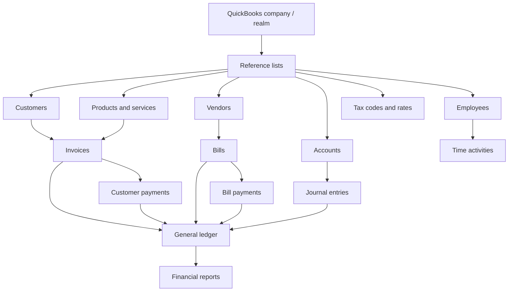

# QuickBooks data model

This diagram summarizes the QuickBooks entities used by the bridge and how operational transactions feed the
general ledger and financial reports.

All entities in this diagram are native QuickBooks sandbox records. The application keeps no local relational
mirror, mapping table, duplicate index, replay record, or audit row.

For the transformations applied when these entities cross the Ruby boundary, see
[`quickbooks_data_normalization.md`](quickbooks_data_normalization.md).

